# Data Flow Diagram - TubeSage

This diagram illustrates the comprehensive data flow throughout the TubeSage plugin for Obsidian, showing how information moves through the system's enhanced architecture and processing pipeline.

```mermaid
%%{init: {
  'theme': 'dark',
  'themeVariables': {
    'fontSize': '14px',
    'primaryColor': '#7aa2f7',
    'primaryTextColor': '#ffffff',
    'primaryBorderColor': '#7aa2f7', 
    'lineColor': '#7aa2f7',
    'secondaryColor': '#bb9af7',
    'tertiaryColor': '#ff9e64'
  },
  'flowchart': {
    'curve': 'basis',
    'useMaxWidth': true,
    'htmlLabels': true,
    'rankSpacing': 70,
    'nodeSpacing': 50
  }
}}%%
flowchart TD
    %% External Data Sources
    YT[YouTube Platform] --> |Video HTML/JSON| ExtractorMobile[Mobile Transcript Extractor]
    YT --> |Video HTML/JSON| ExtractorDesktop[Desktop Transcript Extractor]
    YTAPI[YouTube Data API] --> |Channel/Playlist Data| BatchProcessor[Batch Processor]
    
    %% Core Processing Pipeline
    ExtractorMobile --> |Raw Transcript| TranscriptProcessor[Transcript Processor]
    ExtractorDesktop --> |Raw Transcript| TranscriptProcessor
    TranscriptProcessor --> |Cleaned Transcript| ComplexityAnalyzer[Content Complexity Analyzer]
    ComplexityAnalyzer --> |Analysis Results| ModelSelector[Smart Model Selector]
    
    %% Configuration and Settings
    UserSettings[User Settings] --> |LLM Config| LLMFactory[LLM Factory]
    UserSettings --> |Processing Preferences| ModelSelector
    UserSettings --> |API Keys| APIManager[API Key Manager]
    APIManager --> |Credentials| LLMFactory
    
    %% LLM Factory and Clients
    LLMFactory --> |Provider Selection| LangChainClient[LangChain Unified Client]
    LLMFactory --> |Direct Connection| OllamaClient[Ollama Local Client]
    
    %% Cross-Platform Fetch Infrastructure
    FetchShim[Obsidian Fetch Shim] --> |HTTP Requests| OpenAIAPI[OpenAI API]
    FetchShim --> |HTTP Requests| AnthropicAPI[Anthropic API]
    FetchShim --> |HTTP Requests| GeminiAPI[Google Gemini API]
    FetchShim --> |HTTP Requests| YTAPI
    FetchShim --> |HTTP Requests| YT
    
    %% LLM Processing Flow
    ModelSelector --> |Selected Provider| LangChainClient
    LangChainClient --> |API Calls via Fetch Shim| FetchShim
    OllamaClient --> |Local API Calls| OllamaLocal[Local Ollama Server]
    
    %% API Responses
    OpenAIAPI --> |Completion Response| LangChainClient
    AnthropicAPI --> |Completion Response| LangChainClient
    GeminiAPI --> |Completion Response| LangChainClient
    OllamaLocal --> |Completion Response| OllamaClient
    
    %% Response Processing
    LangChainClient --> |AI Summary| ResponseProcessor[Response Processor]
    OllamaClient --> |AI Summary| ResponseProcessor
    TranscriptProcessor --> |Raw Transcript| ResponseProcessor
    
    %% Timestamp Enhancement Pipeline
    ResponseProcessor --> |Summary Content| TimestampProcessor[Timestamp Processor]
    TimestampProcessor --> |Document Components| ComponentExtractor[Component Extractor]
    ComponentExtractor --> |Content Chunks| ChunkOptimizer[Chunk Optimizer]
    ChunkOptimizer --> |Optimized Chunks| TimestampLinker[Timestamp Link Generator]
    TimestampLinker --> |Enhanced Chunks| LinkValidator[Link Validator]
    LinkValidator --> |Validated Content| DocumentReconstructor[Document Reconstructor]
    
    %% Template and Note Creation
    DocumentReconstructor --> |Enhanced Document| TemplateProcessor[Template Processor]
    Templates[Templater Templates] --> |Template Data| TemplateProcessor
    TemplateProcessor --> |Formatted Content| NoteCreator[Obsidian Note Creator]
    NoteCreator --> |Final Note| ObsidianVault[Obsidian Vault]
    
    %% Performance Monitoring System
    PerformanceMonitor[Performance Monitor] --> |Metrics Collection| MetricsCollector[Metrics Collector]
    TranscriptProcessor --> |Processing Time| PerformanceMonitor
    ResponseProcessor --> |LLM Response Time| PerformanceMonitor
    TimestampProcessor --> |Enhancement Time| PerformanceMonitor
    
    %% Performance Analysis
    MetricsCollector --> |Performance Data| BottleneckAnalyzer[Bottleneck Analyzer]
    BottleneckAnalyzer --> |Analysis Results| OptimizationEngine[Optimization Engine]
    OptimizationEngine --> |Suggestions| UserInterface[User Interface]
    
    %% Error Handling and Recovery
    ErrorHandler[Smart Error Handler] --> |Error Analysis| RecoverySystem[Recovery System]
    ExtractorMobile --> |Extraction Errors| ErrorHandler
    ExtractorDesktop --> |Extraction Errors| ErrorHandler
    LangChainClient --> |API Errors| ErrorHandler
    OllamaClient --> |Connection Errors| ErrorHandler
    TimestampLinker --> |Generation Errors| ErrorHandler
    
    %% Recovery Actions
    RecoverySystem --> |Retry Parameters| ExtractorMobile
    RecoverySystem --> |Retry Parameters| ExtractorDesktop
    RecoverySystem --> |Fallback Methods| LLMFactory
    RecoverySystem --> |Alternative Approaches| TimestampLinker
    
    %% Batch Processing Data Flow
    BatchProcessor --> |Video URLs| QueueManager[Processing Queue Manager]
    QueueManager --> |Sequential Queue| SequentialProcessor[Sequential Processor]
    QueueManager --> |Parallel Queue| ParallelProcessor[Parallel Processor]
    SequentialProcessor --> |Individual Videos| TranscriptProcessor
    ParallelProcessor --> |Concurrent Videos| TranscriptProcessor
    
    %% Mobile Platform Adaptations
    PlatformDetector[Platform Detector] --> |Mobile Optimizations| ExtractorMobile
    PlatformDetector --> |Desktop Features| ExtractorDesktop
    PlatformDetector --> |Platform Config| FetchShim
    
    %% Data Validation and Quality
    QualityChecker[Content Quality Checker] --> |Validation Results| ResponseProcessor
    ResponseProcessor --> |Content Quality| QualityChecker
    TimestampLinker --> |Link Quality| QualityChecker
    
    %% Styling
    style YT fill:#ff9e64,stroke:#ff9e64,color:white
    style YTAPI fill:#ff9e64,stroke:#ff9e64,color:white
    style OpenAIAPI fill:#f7768e,stroke:#f7768e,color:white
    style AnthropicAPI fill:#f7768e,stroke:#f7768e,color:white
    style GeminiAPI fill:#f7768e,stroke:#f7768e,color:white
    style OllamaLocal fill:#f7768e,stroke:#f7768e,color:white
    style FetchShim fill:#73daca,stroke:#73daca,color:#1a1b26
    style LLMFactory fill:#73daca,stroke:#73daca,color:#1a1b26
    style PerformanceMonitor fill:#73daca,stroke:#73daca,color:#1a1b26
    style ErrorHandler fill:#73daca,stroke:#73daca,color:#1a1b26
    style ModelSelector fill:#73daca,stroke:#73daca,color:#1a1b26
    style ObsidianVault fill:#9ece6a,stroke:#9ece6a,color:#1a1b26
    style LangChainClient fill:#bb9af7,stroke:#bb9af7,color:white
    style OllamaClient fill:#bb9af7,stroke:#bb9af7,color:white
    style TimestampProcessor fill:#bb9af7,stroke:#bb9af7,color:white
    style ResponseProcessor fill:#bb9af7,stroke:#bb9af7,color:white
```

## Data Flow Architecture Overview

TubeSage's data flow architecture is designed for maximum flexibility, reliability, and cross-platform compatibility. The system processes information through multiple specialized pipelines while maintaining consistent quality and performance monitoring.

### 🔄 **Core Data Flow Patterns**

#### **1. Multi-Source Input Pipeline**
- **YouTube Platform**: Primary source for video content and transcript data
- **YouTube Data API**: Secondary source for channel/playlist metadata and video listings
- **User Settings**: Configuration data that influences all processing decisions
- **Template System**: Formatting instructions for final note generation

#### **2. Platform-Adaptive Extraction**
- **Desktop Extractor**: Full-featured extraction using standard web APIs and parsing
- **Mobile Extractor**: Optimized extraction methods designed for iOS/Android constraints
- **Intelligent Fallback**: Automatic switching between extraction methods based on success rates
- **Quality Validation**: Continuous validation of extracted content for completeness

#### **3. Unified Processing Pipeline**
- **Content Analysis**: Smart analysis of transcript complexity and length
- **Model Selection**: AI-driven selection of optimal LLM models based on content characteristics
- **Provider Abstraction**: Unified interface across multiple LLM providers
- **Quality Assurance**: Multi-stage validation of processing results

### 🌐 **Cross-Platform Infrastructure**

#### **Obsidian Fetch Shim**
The custom fetch shim serves as the foundation for all network communication:
- **Universal Compatibility**: Works identically on desktop and mobile Obsidian
- **Protocol Abstraction**: Translates between different platform networking requirements
- **Error Handling**: Comprehensive error recovery with platform-specific optimizations
- **Performance Optimization**: Intelligent caching and request optimization

#### **Platform Detection System**
Automatic adaptation based on the runtime environment:
- **Capability Detection**: Identifies available features and limitations
- **Resource Optimization**: Adjusts processing intensity based on device capabilities
- **Network Adaptation**: Optimizes request patterns for mobile network conditions
- **Storage Management**: Platform-aware temporary file and cache management

### 🤖 **Advanced LLM Integration**

#### **Factory Pattern Architecture**
The LLM Factory provides consistent access to multiple AI providers:
- **Provider Abstraction**: Unified interface regardless of underlying API differences
- **Credential Management**: Secure handling of API keys and authentication
- **Connection Pooling**: Efficient management of API connections and rate limits
- **Failover Support**: Automatic fallback to alternative providers when needed

#### **LangChain Integration**
Standardized AI processing through LangChain framework:
- **Multi-Provider Support**: OpenAI, Anthropic, and Google Gemini integration
- **Prompt Optimization**: Advanced prompt engineering for consistent results
- **Response Processing**: Standardized handling of AI responses across providers
- **Error Recovery**: Intelligent retry mechanisms with exponential backoff

#### **Smart Model Selection**
AI-driven optimization of model selection:
- **Content Analysis**: Real-time analysis of transcript complexity and topic density
- **Performance Prediction**: Historical data-based performance predictions
- **Cost Optimization**: Balance between quality and processing cost/time
- **User Preference Integration**: Respect for user preferences while suggesting optimizations

### ⚡ **Performance Monitoring System**

#### **Real-Time Metrics Collection**
Comprehensive tracking of system performance:
- **Component-Level Timing**: Separate metrics for each processing stage
- **Resource Usage**: Memory, network, and CPU utilization tracking
- **Quality Metrics**: Success rates, error frequencies, and output quality scores
- **User Experience Metrics**: Response times and user satisfaction indicators

#### **Intelligent Bottleneck Detection**
Automated identification of performance issues:
- **Pattern Recognition**: Machine learning-based detection of performance anomalies
- **Root Cause Analysis**: Automated drilling down to identify specific bottlenecks
- **Predictive Analysis**: Early warning systems for potential performance degradation
- **Optimization Recommendations**: AI-generated suggestions for performance improvements

### 🔧 **Enhanced Processing Pipelines**

#### **Transcript Processing Pipeline**
Multi-stage processing for optimal content extraction:
1. **Raw Extraction**: Platform-specific extraction with multiple fallback methods
2. **Content Cleaning**: Removal of artifacts, formatting normalization
3. **Quality Validation**: Verification of transcript completeness and accuracy
4. **Metadata Integration**: Combination with video metadata (title, description, duration)
5. **Complexity Analysis**: Assessment of content complexity for downstream processing

#### **AI Enhancement Pipeline**
Sophisticated AI processing with quality controls:
1. **Model Selection**: Smart selection based on content analysis
2. **Prompt Engineering**: Dynamic prompt optimization based on content type
3. **Response Generation**: AI processing with real-time monitoring
4. **Quality Validation**: Multi-criteria validation of AI responses
5. **Post-Processing**: Content refinement and formatting optimization

#### **Timestamp Enhancement Pipeline**
Advanced timestamp processing for navigation enhancement:
1. **Document Parsing**: Intelligent extraction of content structure
2. **Chunk Optimization**: Smart division of content for optimal processing
3. **Heading Detection**: AI-powered identification of section boundaries
4. **Link Generation**: Creation of precise YouTube timestamp links
5. **Validation System**: Comprehensive validation with retry mechanisms
6. **Document Reconstruction**: Seamless integration of enhanced content

### 🔄 **Batch Processing Architecture**

#### **Queue Management System**
Sophisticated handling of multi-video processing:
- **Priority Queuing**: Intelligent prioritization based on content type and user preferences
- **Resource Allocation**: Dynamic allocation of processing resources
- **Progress Tracking**: Real-time monitoring of batch processing progress
- **Error Isolation**: Prevention of single-video failures from affecting entire batches

#### **Parallel Processing Engine**
Optimized concurrent processing capabilities:
- **Concurrency Control**: Intelligent management of simultaneous processing threads
- **Rate Limiting**: Automatic adherence to API rate limits and quotas
- **Load Balancing**: Dynamic distribution of workload across available resources
- **Failure Recovery**: Automatic retry and recovery mechanisms for failed operations

### 🛡️ **Error Handling and Recovery**

#### **Smart Error Recovery System**
Advanced error handling with learning capabilities:
- **Error Classification**: Automatic categorization of errors by type and severity
- **Recovery Strategy Selection**: AI-driven selection of optimal recovery approaches
- **Parameter Optimization**: Dynamic adjustment of processing parameters between retries
- **Learning Integration**: Continuous improvement based on successful recovery patterns

#### **Fallback Mechanisms**
Comprehensive fallback systems for reliability:
- **Extraction Fallbacks**: Multiple extraction methods with automatic switching
- **Provider Fallbacks**: Automatic switching between LLM providers on failure
- **Processing Fallbacks**: Alternative processing approaches for edge cases
- **Quality Fallbacks**: Graceful degradation when optimal quality cannot be achieved

### 📊 **Data Validation and Quality Control**

#### **Multi-Stage Validation**
Comprehensive quality assurance throughout the pipeline:
- **Input Validation**: Verification of source data quality and completeness
- **Processing Validation**: Real-time monitoring of processing quality
- **Output Validation**: Final verification of generated content quality
- **User Feedback Integration**: Continuous improvement based on user feedback

#### **Quality Metrics System**
Sophisticated quality measurement and optimization:
- **Content Quality Scores**: AI-generated quality assessments
- **User Satisfaction Metrics**: Tracking of user satisfaction and engagement
- **Performance Benchmarks**: Continuous benchmarking against quality standards
- **Improvement Tracking**: Monitoring of quality improvements over time

This comprehensive data flow architecture ensures that TubeSage delivers consistent, high-quality results while maintaining excellent performance across all supported platforms and use cases.
