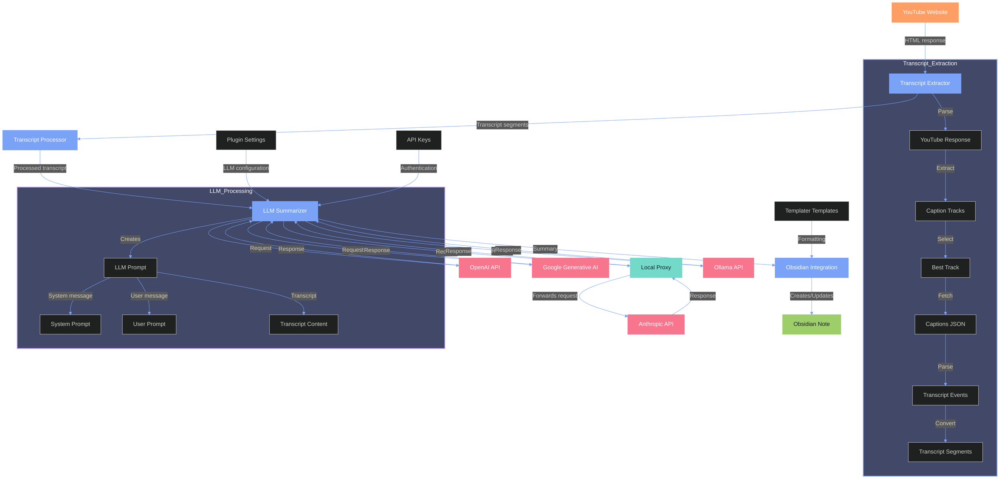

# Data Flow Diagram - YouTube Transcript LLM Plugin

This diagram describes the data flow throughout the YouTube Transcript LLM plugin for Obsidian.

```mermaid
%%{init: {
  'theme': 'dark',
  'themeVariables': {
    'fontSize': '16px',
    'primaryColor': '#7aa2f7',
    'primaryTextColor': '#ffffff',
    'primaryBorderColor': '#7aa2f7', 
    'lineColor': '#7aa2f7',
    'secondaryColor': '#bb9af7',
    'tertiaryColor': '#ff9e64'
  },
  'flowchart': {
    'curve': 'basis',
    'useMaxWidth': false,
    'htmlLabels': true,
    'rankSpacing': 80,
    'nodeSpacing': 60,
    'arrowSize': 1.5,
    'edgeLabelBackground': '#2d333b'
  }
}}%%
flowchart TD
    %% Main components
    YT[YouTube Website] --> |HTML response| TE[Transcript Extractor]
    TE --> |Transcript segments| TP[Transcript Processor]
    TP --> |Processed transcript| LS[LLM Summarizer]
    LS --> |Summary| OI[Obsidian Integration]
    
    %% Configurations and API Keys
    Config[Plugin Settings] --> |LLM configuration| LS
    APIKeys[API Keys] --> |Authentication| LS
    
    %% LLM Providers
    LS --> |Request| OpenAI[OpenAI API]
    LS --> |Request| GG[Google Generative AI]
    LS --> |Request| LP[Local Proxy]
    LS --> |Request| Ollama[Ollama API]
    
    %% Local Proxy for Anthropic
    LP --> |Forwards request| Anthropic[Anthropic API]
    Anthropic --> |Response| LP
    LP --> |Response| LS
    
    %% Other LLM responses
    OpenAI --> |Response| LS
    GG --> |Response| LS
    Ollama --> |Response| LS
    
    %% Templates
    Templates[Templater Templates] --> |Formatting| OI
    
    %% Final output
    OI --> |Creates/Updates| Note[Obsidian Note]
    
    %% Subgraph for Transcript Extractor
    subgraph Transcript_Extraction
        TE --> |Parse| YTR[YouTube Response]
        YTR --> |Extract| Tracks[Caption Tracks]
        Tracks --> |Select| BestTrack[Best Track]
        BestTrack --> |Fetch| JSON[Captions JSON]
        JSON --> |Parse| Events[Transcript Events]
        Events --> |Convert| Segments[Transcript Segments]
    end
    
    %% Subgraph for LLM Integration
    subgraph LLM_Processing
        LS --> |Creates| Prompt[LLM Prompt]
        Prompt --> |System message| System[System Prompt]
        Prompt --> |User message| User[User Prompt]
        Prompt --> |Transcript| Content[Transcript Content]
    end
    
    %% Styling for specific node types
    style YT fill:#ff9e64,stroke:#ff9e64,color:white,stroke-width:2px
    style OpenAI fill:#f7768e,stroke:#f7768e,color:white,stroke-width:2px
    style GG fill:#f7768e,stroke:#f7768e,color:white,stroke-width:2px
    style Anthropic fill:#f7768e,stroke:#f7768e,color:white,stroke-width:2px
    style Ollama fill:#f7768e,stroke:#f7768e,color:white,stroke-width:2px
    style LP fill:#73daca,stroke:#73daca,color:#1a1b26,stroke-width:2px
    style TE fill:#7aa2f7,stroke:#7aa2f7,color:white,stroke-width:2px
    style TP fill:#7aa2f7,stroke:#7aa2f7,color:white,stroke-width:2px
    style LS fill:#7aa2f7,stroke:#7aa2f7,color:white,stroke-width:2px
    style OI fill:#7aa2f7,stroke:#7aa2f7,color:white,stroke-width:2px
    style Note fill:#9ece6a,stroke:#9ece6a,color:#1a1b26,stroke-width:2px
    style Transcript_Extraction fill:#414868,stroke:#7aa2f7,color:white,stroke-width:2px
    style LLM_Processing fill:#414868,stroke:#bb9af7,color:white,stroke-width:2px
```

## Component Descriptions

### Main Components
- **YouTube Website**: Source of video data and transcript information
- **Transcript Extractor**: Extracts transcript segments from YouTube videos
- **Transcript Processor**: Processes raw transcript segments into usable text
- **LLM Summarizer**: Integrates with various LLM providers to summarize transcripts
- **Obsidian Integration**: Handles integration with Obsidian notes and templates

### LLM Providers
- **OpenAI API**: Provides access to OpenAI models (GPT-4, etc.)
- **Google Generative AI**: Provides access to Google's AI models (Gemini, etc.)
- **Local Proxy**: A Node.js proxy server for Anthropic API communication
- **Anthropic API**: Provides access to Anthropic Claude models
- **Ollama API**: Provides access to locally-hosted LLM models

### Data Paths
1. **YouTube to Note Creation**:
   - YouTube video HTML → Extract transcript → Process transcript → Summarize with LLM → Format with templates → Create/update Obsidian note

2. **LLM Processing**:
   - Create prompt from system instructions, user prompt, and transcript content
   - Send to selected LLM provider
   - Receive summary response

3. **Anthropic Special Path**:
   - Start local Node.js proxy server
   - Send request to proxy
   - Proxy forwards to Anthropic API
   - Receive response via proxy