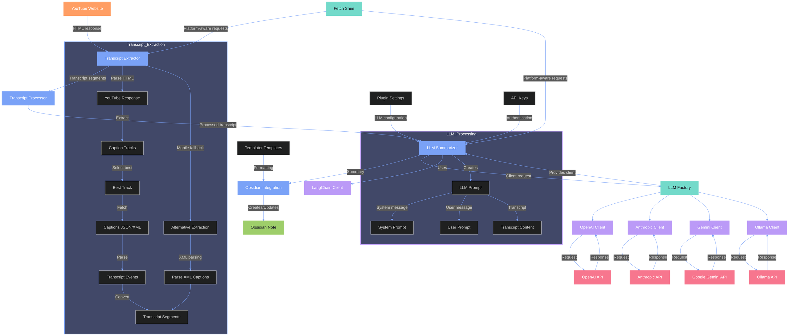

# Data Flow Diagram - TubeSage

This diagram describes the data flow throughout the TubeSage plugin for Obsidian.

```mermaid
%%{init: {
  'theme': 'dark',
  'themeVariables': {
    'fontSize': '16px',
    'primaryColor': '#7aa2f7',
    'primaryTextColor': '#ffffff',
    'primaryBorderColor': '#7aa2f7', 
    'lineColor': '#7aa2f7',
    'secondaryColor': '#bb9af7',
    'tertiaryColor': '#ff9e64'
  },
  'flowchart': {
    'curve': 'basis',
    'useMaxWidth': false,
    'htmlLabels': true,
    'rankSpacing': 80,
    'nodeSpacing': 60,
    'arrowSize': 1.5,
    'edgeLabelBackground': '#2d333b'
  }
}}%%
flowchart TD
    %% Main components
    YT[YouTube Website] --> |HTML response| TE[Transcript Extractor]
    TE --> |Transcript segments| TP[Transcript Processor]
    TP --> |Processed transcript| LS[LLM Summarizer]
    LS --> |Summary| OI[Obsidian Integration]
    
    %% Configurations and API Keys
    Config[Plugin Settings] --> |LLM configuration| LS
    APIKeys[API Keys] --> |Authentication| LS
    
    %% LLM Factory
    LF[LLM Factory] --> |Provides client| LS
    LS --> |Client request| LF
    
    %% LLM Clients
    LF --> OpenAI[OpenAI Client]
    LF --> Anthropic[Anthropic Client]
    LF --> Gemini[Gemini Client]
    LF --> Ollama[Ollama Client]
    LS --> |Uses| LC[LangChain Client]
    
    %% API Connections
    OpenAI --> |Request| OpenAI_API[OpenAI API]
    Anthropic --> |Request| Anthropic_API[Anthropic API]
    Gemini --> |Request| Gemini_API[Google Gemini API]
    Ollama --> |Request| Ollama_API[Ollama API]
    
    %% API Responses
    OpenAI_API --> |Response| OpenAI
    Anthropic_API --> |Response| Anthropic
    Gemini_API --> |Response| Gemini
    Ollama_API --> |Response| Ollama
    
    %% Templates
    Templates[Templater Templates] --> |Formatting| OI
    
    %% Final output
    OI --> |Creates/Updates| Note[Obsidian Note]
    
    %% Mobile & Desktop Platform Handling
    FetchShim[Fetch Shim] --> |Platform-aware requests| TE
    FetchShim --> |Platform-aware requests| LS
    
    %% Subgraph for Transcript Extractor
    subgraph Transcript_Extraction
        TE --> |Parse HTML| YTR[YouTube Response]
        YTR --> |Extract| Tracks[Caption Tracks]
        Tracks --> |Select best| BestTrack[Best Track]
        BestTrack --> |Fetch| JSON[Captions JSON/XML]
        JSON --> |Parse| Events[Transcript Events]
        Events --> |Convert| Segments[Transcript Segments]
        
        %% Mobile fallback path
        TE --> |Mobile fallback| AltExtract[Alternative Extraction]
        AltExtract --> |XML parsing| XMLParse[Parse XML Captions]
        XMLParse --> Segments
    end
    
    %% Subgraph for LLM Processing
    subgraph LLM_Processing
        LS --> |Creates| Prompt[LLM Prompt]
        Prompt --> |System message| System[System Prompt]
        Prompt --> |User message| User[User Prompt]
        Prompt --> |Transcript| Content[Transcript Content]
    end
    
    %% Styling for specific node types
    style YT fill:#ff9e64,stroke:#ff9e64,color:white,stroke-width:2px
    style OpenAI_API fill:#f7768e,stroke:#f7768e,color:white,stroke-width:2px
    style Anthropic_API fill:#f7768e,stroke:#f7768e,color:white,stroke-width:2px
    style Gemini_API fill:#f7768e,stroke:#f7768e,color:white,stroke-width:2px
    style Ollama_API fill:#f7768e,stroke:#f7768e,color:white,stroke-width:2px
    style LF fill:#73daca,stroke:#73daca,color:#1a1b26,stroke-width:2px
    style FetchShim fill:#73daca,stroke:#73daca,color:#1a1b26,stroke-width:2px
    style TE fill:#7aa2f7,stroke:#7aa2f7,color:white,stroke-width:2px
    style TP fill:#7aa2f7,stroke:#7aa2f7,color:white,stroke-width:2px
    style LS fill:#7aa2f7,stroke:#7aa2f7,color:white,stroke-width:2px
    style OI fill:#7aa2f7,stroke:#7aa2f7,color:white,stroke-width:2px
    style Note fill:#9ece6a,stroke:#9ece6a,color:#1a1b26,stroke-width:2px
    style OpenAI fill:#bb9af7,stroke:#bb9af7,color:white,stroke-width:2px
    style Anthropic fill:#bb9af7,stroke:#bb9af7,color:white,stroke-width:2px
    style Gemini fill:#bb9af7,stroke:#bb9af7,color:white,stroke-width:2px
    style Ollama fill:#bb9af7,stroke:#bb9af7,color:white,stroke-width:2px
    style LC fill:#bb9af7,stroke:#bb9af7,color:white,stroke-width:2px
    style Transcript_Extraction fill:#414868,stroke:#7aa2f7,color:white,stroke-width:2px
    style LLM_Processing fill:#414868,stroke:#bb9af7,color:white,stroke-width:2px
```

## Component Descriptions

### Main Components
- **YouTube Website**: Source of video data and transcript information
- **Fetch Shim**: Platform-aware HTTP client for cross-platform compatibility
- **Transcript Extractor**: Extracts transcript segments from YouTube videos with platform-specific fallbacks
- **Transcript Processor**: Processes raw transcript segments into usable text
- **LLM Factory**: Creates and manages different LLM clients
- **LLM Summarizer**: Coordinates summarization across different LLM providers
- **Obsidian Integration**: Handles integration with Obsidian notes and templates

### LLM Clients
- **OpenAI Client**: Interface for OpenAI API (GPT-4, GPT-3.5, etc.)
- **Anthropic Client**: Interface for Anthropic API (Claude models)
- **Gemini Client**: Interface for Google's Gemini API
- **Ollama Client**: Interface for local Ollama models
- **LangChain Client**: Unified interface for multiple providers using LangChain

### External APIs
- **OpenAI API**: OpenAI's cloud API service
- **Anthropic API**: Anthropic's cloud API service
- **Google Gemini API**: Google's AI API service
- **Ollama API**: Local API for running models

### Data Paths
1. **YouTube to Note Creation**:
   - YouTube video HTML → Extract transcript → Process transcript → Summarize with LLM → Format with templates → Create/update Obsidian note

2. **Transcript Extraction**:
   - Regular path: HTML parsing → Track selection → JSON fetching → Segment extraction
   - Mobile fallback: Alternative extraction → XML parsing → Segment creation

3. **LLM Processing**:
   - LLM Factory creates appropriate client
   - Format prompt with system instructions, user prompt, and transcript
   - Send to selected LLM provider via appropriate client
   - Process response into final summary
   
4. **Cross-Platform Compatibility**:
   - Fetch Shim provides platform-specific HTTP requests
   - Mobile-specific extraction fallbacks for device compatibility