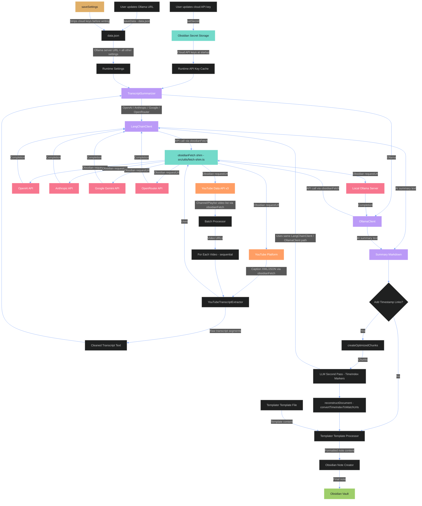

# Data Flow Diagram - TubeSage

This diagram illustrates the comprehensive data flow throughout the TubeSage plugin for Obsidian, showing how information moves through the system's enhanced architecture and processing pipeline.

```mermaid
%%{init: {
  'theme': 'dark',
  'themeVariables': {
    'fontSize': '14px',
    'primaryColor': '#7aa2f7',
    'primaryTextColor': '#ffffff',
    'primaryBorderColor': '#7aa2f7', 
    'lineColor': '#7aa2f7',
    'secondaryColor': '#bb9af7',
    'tertiaryColor': '#ff9e64'
  },
  'flowchart': {
    'curve': 'basis',
    'useMaxWidth': true,
    'htmlLabels': true,
    'rankSpacing': 70,
    'nodeSpacing': 50
  }
}}%%
flowchart TD
    %% Secret Storage and Settings
    SecretStorage[Obsidian Secret Storage] --> |Cloud API keys at startup| RuntimeKeys[Runtime API Key Cache]
    DataJson[data.json] --> |Ollama server URL + all other settings| RuntimeSettings[Runtime Settings]
    RuntimeKeys --> TranscriptSummarizer[TranscriptSummarizer]
    RuntimeSettings --> TranscriptSummarizer

    %% External Data Sources
    YT[YouTube Platform] --> |Caption XML/JSON via obsidianFetch| Extractor[YouTubeTranscriptExtractor]
    YTAPI[YouTube Data API v3] --> |Channel/Playlist video list via obsidianFetch| BatchProcessor[Batch Processor]

    %% Cross-Platform Fetch Infrastructure
    FetchShim[obsidianFetch shim - src/utils/fetch-shim.ts] --> |Obsidian requestUrl| YT
    FetchShim --> |Obsidian requestUrl| YTAPI
    FetchShim --> |Obsidian requestUrl| OpenAIAPI[OpenAI API]
    FetchShim --> |Obsidian requestUrl| AnthropicAPI[Anthropic API]
    FetchShim --> |Obsidian requestUrl| GeminiAPI[Google Gemini API]
    FetchShim --> |Obsidian requestUrl| OpenRouterAPI[OpenRouter API]
    FetchShim --> |Obsidian requestUrl| OllamaLocal[Local Ollama Server]
    Extractor --> |Uses| FetchShim

    %% Core Transcript Pipeline
    Extractor --> |Raw transcript segments| CleanedTranscript[Cleaned Transcript Text]
    CleanedTranscript --> TranscriptSummarizer

    %% LLM Dispatch
    TranscriptSummarizer --> |OpenAI / Anthropic / Google / OpenRouter| LangChainClient[LangChainClient]
    TranscriptSummarizer --> |Ollama| OllamaClient[OllamaClient]

    LangChainClient --> |API call via obsidianFetch| FetchShim
    OllamaClient --> |API call via obsidianFetch| FetchShim

    OpenAIAPI --> |Completion| LangChainClient
    AnthropicAPI --> |Completion| LangChainClient
    GeminiAPI --> |Completion| LangChainClient
    OpenRouterAPI --> |Completion| LangChainClient
    OllamaLocal --> |Completion| OllamaClient

    LangChainClient --> |AI summary text| SummaryText[Summary Markdown]
    OllamaClient --> |AI summary text| SummaryText

    %% Timestamp Enhancement Pipeline (optional)
    SummaryText --> TimestampChoice{Add Timestamp Links?}
    TimestampChoice -->|No| TemplateProcessor[Templater Template Processor]
    TimestampChoice -->|Yes| ChunkOptimizer[createOptimizedChunks]
    ChunkOptimizer --> |Chunks| TimestampLLM[LLM Second Pass - TimeIndex Markers]
    TimestampLLM --> |Uses same LangChainClient / OllamaClient path| LangChainClient
    TimestampLLM --> DocReconstructor[reconstructDocument - convertTimeIndexToWatchUrls]
    DocReconstructor --> TemplateProcessor

    %% Template and Note Creation
    TemplaterTemplate[Templater Template File] --> |Template content| TemplateProcessor
    TemplateProcessor --> |Formatted note content| NoteCreator[Obsidian Note Creator]
    NoteCreator --> |Final note| ObsidianVault[Obsidian Vault]

    %% Batch Processing
    BatchProcessor --> |Video URLs| VideoLoop[For Each Video - sequential]
    VideoLoop --> Extractor

    %% Settings persistence
    CloudKeyUpdate[User updates cloud API key] --> |setSecret| SecretStorage
    OllamaUrlUpdate[User updates Ollama URL] --> |saveData - data.json| DataJson
    SaveSettings[saveSettings] --> |Strips cloud keys before writing| DataJson

    %% Styling
    style YT fill:#ff9e64,stroke:#ff9e64,color:white
    style YTAPI fill:#ff9e64,stroke:#ff9e64,color:white
    style OpenAIAPI fill:#f7768e,stroke:#f7768e,color:white
    style AnthropicAPI fill:#f7768e,stroke:#f7768e,color:white
    style GeminiAPI fill:#f7768e,stroke:#f7768e,color:white
    style OpenRouterAPI fill:#f7768e,stroke:#f7768e,color:white
    style OllamaLocal fill:#f7768e,stroke:#f7768e,color:white
    style FetchShim fill:#73daca,stroke:#73daca,color:#1a1b26
    style SecretStorage fill:#73daca,stroke:#73daca,color:#1a1b26
    style ObsidianVault fill:#9ece6a,stroke:#9ece6a,color:#1a1b26
    style LangChainClient fill:#bb9af7,stroke:#bb9af7,color:white
    style OllamaClient fill:#bb9af7,stroke:#bb9af7,color:white
    style TranscriptSummarizer fill:#bb9af7,stroke:#bb9af7,color:white
    style SummaryText fill:#bb9af7,stroke:#bb9af7,color:white
    style SaveSettings fill:#e0af68,stroke:#e0af68,color:#1a1b26
```

## Data Flow Architecture Overview

TubeSage's data flow is built around a single cross-platform HTTP abstraction (`obsidianFetch`) and a clear separation between secret and non-secret configuration storage. All data moves through a linear pipeline: YouTube URL → transcript extraction → optional LLM summarization → optional timestamp enhancement → template application → note creation.

### **Credential and Settings Storage**

Two distinct stores hold plugin state:

- **Obsidian Secret Storage**: Cloud provider API keys for OpenAI, Anthropic, Google, and OpenRouter. Keys are written via `app.secretStorage.setSecret` and read back into the runtime `apiKeys` cache at startup. They are never written to `data.json`. If a legacy key is found in `data.json` on load, it is migrated to secret storage and the `data.json` copy is scrubbed.
- **`data.json`** (plugin data): All other settings — the selected provider, selected models, prompt text, folder paths, temperature, max tokens, and the Ollama server URL. The `saveSettings` method explicitly strips cloud API keys before writing.

### **Cross-Platform HTTP: `obsidianFetch`**

`src/utils/fetch-shim.ts` wraps Obsidian's `requestUrl` method behind a standard `fetch`-compatible interface. All outbound network calls — to the YouTube caption API, YouTube Data API v3, OpenAI, Anthropic, Google Gemini, OpenRouter, and the local Ollama server — go through this shim. This is what makes the plugin work identically on desktop and mobile Obsidian.

### **Transcript Extraction**

`YouTubeTranscriptExtractor` (a static utility class in `src/youtube-transcript.ts`) fetches transcript data from YouTube via `obsidianFetch`. It runs a layered fallback cascade, trying each method in order until one succeeds: the ScrapeCreators API (paid, only if a key is set), watch-page captions, the ANDROID Player API, the MWEB Player API, the WEB ScrapeCreators / local innertube path, and finally the Supadata API (paid, only if a key is set). An error is surfaced only if every method fails. There is no separate desktop extractor and mobile extractor — platform adaptation is entirely handled by the `obsidianFetch` shim.

### **LLM Integration**

`TranscriptSummarizer` receives the cleaned transcript and the selected provider name. It dispatches to one of two paths:

- **Cloud providers (OpenAI, Anthropic, Google, OpenRouter)**: All routed through `LangChainClient`. Internally, OpenAI and OpenRouter use `ChatOpenAI` with LangChain's standard invocation. Anthropic and Google use direct `obsidianFetch` calls (bypassing their SDKs to avoid browser-environment detection issues), but this is an internal implementation detail — from the data-flow perspective they share the `LangChainClient` dispatch.
- **Ollama**: Routed through `OllamaClient`, which makes direct JSON API calls to the configured local server URL via `obsidianFetch`.

LangChain's tiktoken helper is replaced at build time by a no-op stub in `esbuild.config.mjs`. No request is ever made to `tiktoken.pages.dev`.

### **Timestamp Enhancement Pipeline** *(optional)*

If timestamp links are enabled:
1. The LLM summary is split into chunks using `createOptimizedChunks` (respects model context limits)
2. A second LLM pass adds `[TimeIndex:SECONDS]` markers to section headings
3. `convertTimeIndexToWatchUrls` converts those markers to clickable YouTube watch-URL timestamp links
4. `reconstructDocument` assembles the final document

### **Template Application and Note Creation**

The Templater plugin (if installed and configured) processes the summary through the configured template file. The output is written as a new note into the output folder within the Obsidian vault. Folder and template file paths are resolved using `collectUnder` — a scoped subtree traversal in `src/utils/path-utils.ts` that avoids enumerating the whole vault.

### **Batch Processing**

Channel and playlist processing uses the YouTube Data API v3 (requires a separate YouTube API key stored in plugin settings). Videos are fetched with pagination and a configurable safety limit, then processed sequentially through the same single-video pipeline.
