# Workflow Diagram - TubeSage

This diagram describes the complete user and system workflow for the TubeSage plugin for Obsidian, including the latest features and architecture improvements.

```mermaid
%%{init: {
  'theme': 'dark',
  'themeVariables': {
    'fontSize': '14px',
    'primaryColor': '#7aa2f7',
    'primaryTextColor': '#ffffff',
    'primaryBorderColor': '#7aa2f7', 
    'lineColor': '#7aa2f7',
    'secondaryColor': '#bb9af7',
    'tertiaryColor': '#ff9e64'
  },
  'flowchart': {
    'curve': 'basis',
    'useMaxWidth': true,
    'htmlLabels': true,
    'rankSpacing': 70,
    'nodeSpacing': 50
  }
}}%%
flowchart TD
    %% Entry Points
    Start([User Starts]) --> Setup{Plugin Setup Complete?}
    Setup -->|No| Config[Configure Settings]
    Config --> LicenseCheck[Accept License]
    LicenseCheck --> APISetup[Setup API Keys]
    APISetup --> Setup
    Setup -->|Yes| UserAction{User Action}
    
    %% User Actions
    UserAction -->|Ribbon Click| RibbonModal[Open Main Modal]
    UserAction -->|Command Palette| CommandModal[Extract YouTube Transcript]
    UserAction -->|Direct URL| ProcessURL[Process URL Directly]
    
    %% Modal Flow
    RibbonModal --> URLInput[Enter YouTube URL]
    CommandModal --> URLInput
    URLInput --> URLValidation{Valid YouTube URL?}
    URLValidation -->|No| ErrorMsg[Show Error Message]
    URLValidation -->|Yes| URLType{URL Type Detection}
    
    %% URL Type Processing
    URLType -->|Single Video| VideoFlow[Single Video Processing]
    URLType -->|Channel/Playlist| BatchFlow[Batch Processing]
    
    %% Single Video Flow
    VideoFlow --> PlatformDetect{Platform Detection}
    PlatformDetect -->|Desktop| DesktopExtract[Desktop Transcript Extraction]
    PlatformDetect -->|Mobile| MobileExtract[Mobile Optimized Extraction]
    
    %% Transcript Extraction
    DesktopExtract --> TranscriptCheck{Transcript Available?}
    MobileExtract --> TranscriptCheck
    TranscriptCheck -->|No| FallbackMethod[Try Alternative Methods]
    FallbackMethod --> SmartRecovery[Smart Recovery System]
    SmartRecovery --> TranscriptCheck
    TranscriptCheck -->|Yes| MetadataExtract[Extract Video Metadata]
    
    %% LLM Processing
    MetadataExtract --> LLMChoice{Use LLM Summarization?}
    LLMChoice -->|No| DirectNote[Create Note Directly]
    LLMChoice -->|Yes| ModelSelection[Smart Model Selection]
    ModelSelection --> ProviderSelect{LLM Provider}
    
    %% LLM Provider Paths
    ProviderSelect -->|OpenAI| OpenAIClient[OpenAI via LangChain]
    ProviderSelect -->|Anthropic| AnthropicClient[Anthropic via LangChain]
    ProviderSelect -->|Google| GeminiClient[Gemini via LangChain]
    ProviderSelect -->|Ollama| OllamaClient[Direct Ollama API]
    
    %% LLM Response Processing
    OpenAIClient --> LLMResponse[Process LLM Response]
    AnthropicClient --> LLMResponse
    GeminiClient --> LLMResponse
    OllamaClient --> LLMResponse
    
    %% Timestamp Processing
    LLMResponse --> TimestampCheck{Add Timestamps?}
    TimestampCheck -->|No| TemplateApply[Apply Template]
    TimestampCheck -->|Yes| ChunkContent[Create Optimized Chunks]
    ChunkContent --> ProcessChunks[Process Each Chunk]
    ProcessChunks --> AddTimestamps[Add Timestamp Links]
    AddTimestamps --> ValidateLinks[Validate Generated Links]
    ValidateLinks --> ReconstructDoc[Reconstruct Document]
    ReconstructDoc --> TemplateApply
    
    %% Final Note Creation
    DirectNote --> TemplateApply
    TemplateApply --> CreateNote[Create Obsidian Note]
    CreateNote --> PerformanceLog[Log Performance Metrics]
    PerformanceLog --> Success[Success - Note Created]
    
    %% Batch Processing Flow
    BatchFlow --> APIKeyCheck{YouTube API Key Set?}
    APIKeyCheck -->|No| APIKeyError[Show API Key Required Error]
    APIKeyCheck -->|Yes| FetchVideos[Fetch Channel/Playlist Videos]
    FetchVideos --> BatchConfig[Configure Batch Settings]
    BatchConfig --> ProcessingMode{Processing Mode}
    ProcessingMode -->|Sequential| SequentialBatch[Process Videos in Sequence]
    ProcessingMode -->|Parallel| ParallelBatch[Process Videos in Parallel]
    SequentialBatch --> VideoLoop[For Each Video]
    ParallelBatch --> VideoLoop
    VideoLoop --> VideoFlow
    
    %% Error Handling
    ErrorMsg --> UserAction
    APIKeyError --> Config
    SmartRecovery --> ErrorAnalysis[Analyze Error Type]
    ErrorAnalysis --> RetryStrategy[Determine Retry Strategy]
    RetryStrategy --> MaxRetries{Max Retries Reached?}
    MaxRetries -->|No| FallbackMethod
    MaxRetries -->|Yes| FinalError[Show Final Error]
    FinalError --> End([End])
    
    %% Performance Monitoring
    PerformanceLog --> BottleneckCheck[Check for Bottlenecks]
    BottleneckCheck --> OptimizationSugg[Generate Optimization Suggestions]
    OptimizationSugg --> End
    Success --> End
    
    %% Styling
    style Start fill:#73daca,stroke:#73daca,color:#1a1b26
    style End fill:#73daca,stroke:#73daca,color:#1a1b26
    style Success fill:#9ece6a,stroke:#9ece6a,color:#1a1b26
    style ErrorMsg fill:#f7768e,stroke:#f7768e,color:white
    style APIKeyError fill:#f7768e,stroke:#f7768e,color:white
    style FinalError fill:#f7768e,stroke:#f7768e,color:white
    style LLMResponse fill:#bb9af7,stroke:#bb9af7,color:white
    style CreateNote fill:#ff9e64,stroke:#ff9e64,color:white
    style SmartRecovery fill:#e0af68,stroke:#e0af68,color:white
```

## Workflow Overview

The TubeSage workflow is designed for maximum flexibility and reliability across different platforms and use cases. The system intelligently adapts to user needs while providing robust error recovery and performance optimization.

### Key Workflow Features

#### 🚀 **Setup and Configuration**
- **License Validation**: Ensures user acceptance of MIT license before operation
- **API Key Management**: Secure configuration of multiple LLM provider credentials
- **Platform Detection**: Automatic detection and optimization for desktop vs mobile environments
- **Settings Persistence**: All configurations are saved and restored between sessions

#### 🎯 **User Interaction Modes**
- **Ribbon Interface**: Quick access via the YouTube icon in Obsidian's ribbon
- **Command Palette**: Integration with Obsidian's command system for keyboard-driven workflows
- **Direct URL Processing**: Seamless handling when users paste YouTube URLs directly

#### 🔍 **Intelligent URL Processing**
- **URL Validation**: Comprehensive validation ensuring only valid YouTube URLs are processed
- **Type Detection**: Automatic identification of single videos vs channels/playlists
- **Error Guidance**: Helpful error messages with specific solutions for common issues

#### 📱 **Cross-Platform Extraction**
- **Desktop Optimization**: Full-featured extraction using standard web APIs
- **Mobile Adaptation**: Specialized extraction methods optimized for iOS/Android limitations
- **Fallback Systems**: Multiple extraction methods ensure high success rates
- **Smart Recovery**: Intelligent retry mechanisms with parameter optimization

#### 🤖 **Advanced LLM Integration**
- **Smart Model Selection**: AI-driven recommendations based on content complexity and length
- **Unified Provider Interface**: Consistent experience across OpenAI, Anthropic, Google, and Ollama
- **LangChain Integration**: Standardized API interface for cloud providers
- **Local Processing**: Direct Ollama integration for privacy-focused users

#### ⏱️ **Intelligent Timestamp Processing**
- **Optimized Chunking**: Smart content division to respect LLM token limits
- **Heading Detection**: Automatic identification of section headings for timestamp placement
- **Link Generation**: Creation of clickable YouTube timestamp links
- **Validation System**: Comprehensive validation of generated links with retry mechanisms

#### 📊 **Performance Monitoring**
- **Real-time Metrics**: Continuous tracking of processing times across all components
- **Bottleneck Detection**: Automatic identification of performance issues
- **Optimization Suggestions**: AI-driven recommendations for performance improvements
- **Component-level Tracking**: Separate metrics for extraction, LLM processing, and timestamp generation

### Workflow Phases

#### **Phase 1: Initialization**
1. Plugin loads and checks for proper configuration
2. License acceptance validation
3. API key verification for selected providers
4. Platform detection and adaptation
5. Performance monitoring initialization

#### **Phase 2: User Input**
1. User selects input method (ribbon, command palette, or direct URL)
2. URL input and validation
3. URL type detection (single video vs batch processing)
4. Configuration selection (summary mode, folder, etc.)

#### **Phase 3: Content Extraction**
1. Platform-specific transcript extraction
2. Multiple fallback methods for reliability
3. Smart recovery system for failed extractions
4. Video metadata extraction (title, description, duration)

#### **Phase 4: AI Processing**
1. Smart model selection based on content analysis
2. LLM provider initialization via factory pattern
3. Content summarization with optimized prompts
4. Response validation and quality checks

#### **Phase 5: Enhancement**
1. Document component extraction (frontmatter, content)
2. Optimized content chunking for timestamp processing
3. Timestamp link generation and validation
4. Document reconstruction with enhanced content

#### **Phase 6: Finalization**
1. Template application via Templater integration
2. Note creation in specified Obsidian folder
3. Performance metrics logging
4. Optimization suggestions generation

### Batch Processing Workflow

#### **Collection Processing**
1. YouTube API integration for channel/playlist data
2. Video list extraction with quota management
3. Processing mode selection (sequential vs parallel)
4. Progress tracking and user feedback

#### **Parallel Processing Features**
- Configurable concurrency limits
- Rate limiting to respect API quotas
- Progress monitoring for multiple videos
- Error isolation (single video failures don't stop batch)

### Error Handling Strategy

#### **Smart Recovery System**
- **Error Classification**: Automatic categorization by type and severity
- **Retry Logic**: Intelligent retry strategies with exponential backoff
- **Parameter Adjustment**: Dynamic optimization between retry attempts
- **Fallback Methods**: Alternative approaches when primary methods fail
- **User Feedback**: Clear error messages with actionable solutions

#### **Common Error Scenarios**
- Network connectivity issues on mobile devices
- API rate limiting and quota exhaustion
- Invalid or unavailable YouTube content
- LLM API failures and timeout handling
- Template processing errors

### Performance Optimization

#### **Adaptive Processing**
- Content complexity analysis for model selection
- Platform-specific optimizations (mobile vs desktop)
- Dynamic chunk size adjustment based on content length
- Memory usage optimization for large transcripts

#### **Monitoring and Analytics**
- Real-time performance tracking
- Historical performance data
- Bottleneck identification and resolution
- Optimization suggestions based on usage patterns

This comprehensive workflow ensures that TubeSage provides a reliable, efficient, and user-friendly experience while maintaining high-quality output across all supported platforms and use cases.
