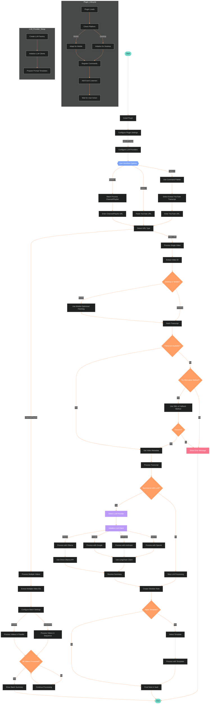

# Workflow Diagram - TubeSage

This diagram describes the user and system workflow for the TubeSage plugin for Obsidian.

```mermaid
%%{init: {
  'theme': 'dark',
  'themeVariables': {
    'fontSize': '16px',
    'primaryColor': '#ff9e64',
    'primaryTextColor': '#ffffff',
    'primaryBorderColor': '#ff9e64', 
    'lineColor': '#ff9e64',
    'secondaryColor': '#7aa2f7',
    'tertiaryColor': '#bb9af7'
  },
  'flowchart': {
    'curve': 'basis',
    'useMaxWidth': false,
    'htmlLabels': true,
    'rankSpacing': 80,
    'nodeSpacing': 60,
    'arrowSize': 1.5,
    'edgeLabelBackground': '#2d333b'
  }
}}%%
flowchart TB
    %% Main workflow steps
    Start([Start]) --> InstallPlugin[Install Plugin]
    InstallPlugin --> ConfigPlugin[Configure Plugin Settings]
    ConfigPlugin --> |Add API Keys| ConfigLLM[Configure LLM Providers]
    ConfigLLM --> UserWorkflow
    
    %% User workflow branch
    UserWorkflow{{User Workflow Options}}
    UserWorkflow --> |Option 1| Command[Use Command Palette]
    UserWorkflow --> |Option 2| URL[Paste YouTube URL]
    UserWorkflow --> |Option 3| BatchProcess[Batch Process Channel/Playlist]
    
    %% Command palette flow
    Command --> SelectCommand[Select Extract YouTube Transcript]
    SelectCommand --> EnterURL[Enter YouTube URL]
    EnterURL --> DetectType
    
    %% URL input flow
    URL --> DetectType[Detect URL Type]
    
    %% Batch process flow
    BatchProcess --> EnterChannelURL[Enter Channel/Playlist URL]
    EnterChannelURL --> DetectType
    
    %% URL type detection
    DetectType --> |Video URL| ProcessVideo[Process Single Video]
    DetectType --> |Channel/Playlist| ProcessBatch[Process Multiple Videos]
    
    %% Single video processing flow
    ProcessVideo --> ExtractID[Extract Video ID]
    ExtractID --> DetectPlatform
    
    %% Platform detection
    DetectPlatform{Desktop or Mobile?}
    DetectPlatform --> |Desktop| FetchTranscript[Fetch Transcript]
    DetectPlatform --> |Mobile| AdaptFetching[Use Mobile-Optimized Fetching]
    AdaptFetching --> FetchTranscript
    
    %% Transcript availability check
    FetchTranscript --> TranscriptCheck{Transcript Available?}
    TranscriptCheck --> |No| TryAlternative{Try Alternative Method?}
    TryAlternative --> |Yes| AlternativeFetch[Use XML or Fallback Method]
    TryAlternative --> |No| Error[Show Error Message]
    AlternativeFetch --> TranscriptRecheck{Success?}
    TranscriptRecheck --> |No| Error
    TranscriptRecheck --> |Yes| GetMetadata
    TranscriptCheck --> |Yes| GetMetadata[Get Video Metadata]
    
    %% Processing transcript
    GetMetadata --> ProcessTranscript[Process Transcript]
    ProcessTranscript --> SummarizeCheck{Summarize with LLM?}
    
    %% LLM branch
    SummarizeCheck --> |Yes| SelectLLM[Select LLM Provider]
    SelectLLM --> InitializeLLM[Initialize LLM Client]
    InitializeLLM --> |OpenAI| OpenAIFlow[Process with OpenAI]
    InitializeLLM --> |Anthropic| AnthropicFlow[Process with Anthropic]
    InitializeLLM --> |Google| GoogleFlow[Process with Google]
    InitializeLLM --> |Ollama| OllamaFlow[Process with Ollama]
    
    %% LLM processing
    OpenAIFlow --> UseLangChain[Use LangChain Client]
    AnthropicFlow --> UseLangChain
    GoogleFlow --> UseLangChain
    OllamaFlow --> DirectAPI[Use Direct Ollama API]
    
    %% LLM response paths
    UseLangChain --> ReceiveSummary[Receive Summary]
    DirectAPI --> ReceiveSummary
    
    %% No LLM branch
    SummarizeCheck --> |No| SkipLLM[Skip LLM Processing]
    SkipLLM --> CreateNote
    
    %% Final note creation
    ReceiveSummary --> CreateNote[Create Obsidian Note]
    CreateNote --> ApplyTemplate{Apply Template?}
    
    %% Template branch
    ApplyTemplate --> |Yes| SelectTemplate[Select Template]
    SelectTemplate --> ProcessTemplate[Process with Templater]
    ProcessTemplate --> FinalNote[Final Note in Vault]
    
    %% No template branch
    ApplyTemplate --> |No| FinalNote
    
    %% Error handling
    Error --> End([End])
    FinalNote --> End
    
    %% Batch processing flow
    ProcessBatch --> ExtractIDs[Extract Multiple Video IDs]
    ExtractIDs --> ConfigureBatch[Configure Batch Settings]
    ConfigureBatch --> |Sequential| ProcessSequentially[Process Videos in Sequence]
    ConfigureBatch --> |Parallel| ProcessParallel[Process Videos in Parallel]
    ProcessSequentially --> BatchComplete{All Videos Processed?}
    ProcessParallel --> BatchComplete
    BatchComplete --> |No| ContinueBatch[Continue Processing]
    BatchComplete --> |Yes| BatchSummary[Show Batch Summary]
    ContinueBatch --> BatchComplete
    BatchSummary --> End
    
    %% Plugin lifecycle
    subgraph Plugin_Lifecycle
        direction TB
        PluginLoad[Plugin Loads] --> CheckPlatform[Check Platform]
        CheckPlatform --> |Mobile| AdaptMobile[Adapt for Mobile]
        CheckPlatform --> |Desktop| DesktopInit[Initialize for Desktop]
        AdaptMobile --> RegisterCommands[Register Commands]
        DesktopInit --> RegisterCommands
        RegisterCommands --> AddEventListeners[Add Event Listeners]
        AddEventListeners --> WaitForUser[Wait for User Action]
    end
    
    %% LLM Provider setup
    subgraph LLM_Provider_Setup
        direction TB
        CreateFactory[Create LLM Factory] --> InitClients[Initialize LLM Clients]
        InitClients --> PreparePromptTemplates[Prepare Prompt Templates]
    end
    
    %% Styling for specific node types
    style Start fill:#73daca,stroke:#73daca,color:#1a1b26,stroke-width:2px
    style End fill:#73daca,stroke:#73daca,color:#1a1b26,stroke-width:2px
    style Error fill:#f7768e,stroke:#f7768e,color:white,stroke-width:2px
    style TranscriptCheck fill:#ff9e64,stroke:#ff9e64,color:white,stroke-width:2px
    style SummarizeCheck fill:#ff9e64,stroke:#ff9e64,color:white,stroke-width:2px
    style ApplyTemplate fill:#ff9e64,stroke:#ff9e64,color:white,stroke-width:2px
    style DetectPlatform fill:#ff9e64,stroke:#ff9e64,color:white,stroke-width:2px
    style TryAlternative fill:#ff9e64,stroke:#ff9e64,color:white,stroke-width:2px
    style TranscriptRecheck fill:#ff9e64,stroke:#ff9e64,color:white,stroke-width:2px
    style BatchComplete fill:#ff9e64,stroke:#ff9e64,color:white,stroke-width:2px
    style UserWorkflow fill:#7aa2f7,stroke:#7aa2f7,color:white,stroke-width:2px
    style SelectLLM fill:#bb9af7,stroke:#bb9af7,color:white,stroke-width:2px
    style InitializeLLM fill:#bb9af7,stroke:#bb9af7,color:white,stroke-width:2px
```

## Workflow Phases

### Setup Phase
1. **Installation**: User installs the plugin in Obsidian
2. **Configuration**: User configures the plugin settings
3. **API Keys**: User adds appropriate API keys for desired LLM providers

### User Interaction Phase
1. **Command Palette**: User can invoke the plugin via Obsidian's command palette
2. **Direct URL**: User can paste a YouTube URL directly into a note
3. **Batch Processing**: User can process YouTube channels or playlists

### Processing Phase
1. **URL Processing**: 
   - Detect URL type (video, channel, playlist)
   - Extract YouTube video ID(s)
   - Platform detection (mobile vs desktop)
   - Fetch transcript with platform-specific optimizations

2. **Transcript Processing**:
   - Multiple extraction methods with fallbacks for better reliability
   - XML and JSON format support
   - Adaptive processing for mobile compatibility
   - Get video metadata (title, author)

3. **LLM Processing**:
   - Factory-based LLM client initialization
   - Provider selection (OpenAI, Anthropic, Google, Ollama)
   - LangChain integration for most providers
   - Direct API usage for Ollama
   - Prompt template processing

4. **Note Creation**:
   - Create or update Obsidian note with transcript/summary
   - Optionally apply Templater template
   - Final note appears in Obsidian vault

### Batch Processing
- **Channel/Playlist Handling**: Extract and process multiple videos
- **Concurrent Processing**: Option to process videos in parallel
- **Sequential Processing**: Option to process videos one by one
- **Batch Summary**: Final report of processing results

### Plugin Lifecycle
- **Platform Detection**: Adapt behavior for mobile vs desktop
- **Initialization**: Initialize components based on platform
- **Command Registration**: Make commands available in Obsidian
- **Event Handling**: Respond to user actions and system events