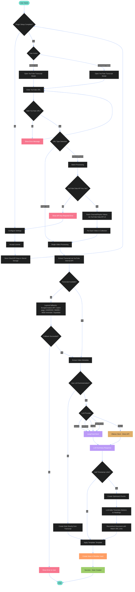

# Workflow Diagram - TubeSage

This diagram describes the complete user and system workflow for the TubeSage plugin for Obsidian, including the latest features and architecture improvements.

```mermaid
%%{init: {
  'theme': 'dark',
  'themeVariables': {
    'fontSize': '14px',
    'primaryColor': '#7aa2f7',
    'primaryTextColor': '#ffffff',
    'primaryBorderColor': '#7aa2f7', 
    'lineColor': '#7aa2f7',
    'secondaryColor': '#bb9af7',
    'tertiaryColor': '#ff9e64'
  },
  'flowchart': {
    'curve': 'basis',
    'useMaxWidth': true,
    'htmlLabels': true,
    'rankSpacing': 70,
    'nodeSpacing': 50
  }
}}%%
flowchart TD
    %% Entry Points
    Start([User Starts]) --> Setup{Plugin Setup Complete?}
    Setup -->|No| Config[Configure Settings]
    Config --> LicenseCheck[Accept License]
    LicenseCheck --> APISetup[Store Cloud API Keys in Secret Storage]
    APISetup --> Setup
    Setup -->|Yes| UserAction{User Action}

    %% User Actions
    UserAction -->|Ribbon Icon| RibbonModal[Open YouTube Transcript Modal]
    UserAction -->|Command Palette| CommandModal[Open YouTube Transcript Modal]

    %% Modal Flow
    RibbonModal --> URLInput[Enter YouTube URL]
    CommandModal --> URLInput
    URLInput --> URLValidation{Valid YouTube URL?}
    URLValidation -->|No| ErrorMsg[Show Error Message]
    URLValidation -->|Yes| URLType{URL Type Detection}
    ErrorMsg --> URLInput

    %% URL Type Processing
    URLType -->|Single Video| VideoFlow[Single Video Processing]
    URLType -->|Channel/Playlist| BatchFlow[Batch Processing]

    %% Single Video Flow
    VideoFlow --> TranscriptExtract[Extract Transcript via YouTube Internal API]
    TranscriptExtract --> TranscriptCheck{Transcript Available?}
    TranscriptCheck -->|No| FallbackMethod[Layered fallbacks: ScrapeCreators API / watch-page / ANDROID / MWEB / WEB innertube / Supadata]
    FallbackMethod --> FallbackCheck{Fallback Succeeded?}
    FallbackCheck -->|No| FinalError[Show Error to User]
    FallbackCheck -->|Yes| MetadataExtract[Extract Video Metadata]
    TranscriptCheck -->|Yes| MetadataExtract

    %% LLM Processing
    MetadataExtract --> LLMChoice{Use LLM Summarization?}
    LLMChoice -->|No| DirectNote[Create Note Directly from Transcript]
    LLMChoice -->|Yes| ProviderSelect{LLM Provider}

    %% LLM Provider Paths
    ProviderSelect -->|OpenAI| CloudClient[LangChainClient]
    ProviderSelect -->|Anthropic| CloudClient
    ProviderSelect -->|Google| CloudClient
    ProviderSelect -->|OpenRouter| CloudClient
    ProviderSelect -->|Ollama| OllamaClient[Ollama Client - Direct API]

    %% LLM Response Processing
    CloudClient --> LLMResponse[LLM Summary Response]
    OllamaClient --> LLMResponse

    %% Timestamp Processing
    LLMResponse --> TimestampCheck{Add Timestamp Links?}
    TimestampCheck -->|No| TemplateApply[Apply Templater Template]
    TimestampCheck -->|Yes| ChunkContent[Create Optimized Chunks]
    ChunkContent --> AddTimestamps[LLM Adds TimeIndex Markers to Headings]
    AddTimestamps --> ReconstructDoc[Reconstruct Document with Watch URL Links]
    ReconstructDoc --> TemplateApply

    %% Final Note Creation
    DirectNote --> TemplateApply
    TemplateApply --> CreateNote[Create Note in Obsidian Vault]
    CreateNote --> Success[Success - Note Created]
    Success --> End([End])
    FinalError --> End

    %% Batch Processing Flow
    BatchFlow --> APIKeyCheck{YouTube Data API Key Set?}
    APIKeyCheck -->|No| APIKeyError[Show API Key Required Error]
    APIKeyCheck -->|Yes| FetchVideos[Fetch Channel/Playlist Videos via YouTube Data API v3]
    FetchVideos --> VideoLoop[For Each Video in Collection]
    VideoLoop --> VideoFlow
    APIKeyError --> Config

    %% Styling
    style Start fill:#73daca,stroke:#73daca,color:#1a1b26
    style End fill:#73daca,stroke:#73daca,color:#1a1b26
    style Success fill:#9ece6a,stroke:#9ece6a,color:#1a1b26
    style ErrorMsg fill:#f7768e,stroke:#f7768e,color:white
    style APIKeyError fill:#f7768e,stroke:#f7768e,color:white
    style FinalError fill:#f7768e,stroke:#f7768e,color:white
    style LLMResponse fill:#bb9af7,stroke:#bb9af7,color:white
    style CreateNote fill:#ff9e64,stroke:#ff9e64,color:white
    style CloudClient fill:#bb9af7,stroke:#bb9af7,color:white
    style OllamaClient fill:#e0af68,stroke:#e0af68,color:#1a1b26
```

## Workflow Overview

The TubeSage workflow processes YouTube content into structured Obsidian notes through a pipeline of transcript extraction, optional LLM summarization, and template application. The plugin requires Obsidian 1.11.4 or later and runs on both desktop and mobile.

### Key Workflow Features

#### **Setup and Configuration**
- **License Validation**: Ensures user acceptance of MIT license before operation
- **API Key Management**: Cloud provider keys (OpenAI, Anthropic, Google, OpenRouter) are stored in Obsidian's native secret storage and never written to `data.json`. The Ollama server URL is the only LLM-related value stored in plugin data.
- **Settings Persistence**: All non-secret configuration is saved to `data.json` and restored between sessions

#### **User Interaction Modes**
- **Ribbon Interface**: Quick access via the YouTube icon in Obsidian's left ribbon
- **Command Palette**: Integration with Obsidian's command system for keyboard-driven workflows

#### **Intelligent URL Processing**
- **URL Validation**: Ensures only valid YouTube URLs are processed before any network request
- **Type Detection**: Automatic identification of single videos vs channels/playlists
- **Error Guidance**: Error messages are shown inline in the modal

#### **Cross-Platform Extraction**
- **Unified Extractor**: `YouTubeTranscriptExtractor` handles both desktop and mobile — cross-platform HTTP is handled by the `obsidianFetch` shim wrapping Obsidian's `requestUrl`
- **Fallback Systems**: Six extraction methods are tried in order — paid APIs (ScrapeCreators, Supadata) run only when their keys are configured; free methods (watch-page, ANDROID Player API, MWEB Player API, WEB innertube) are always attempted in sequence between them

#### **LLM Integration**
- **Cloud Providers**: OpenAI, Anthropic, Google, and OpenRouter are all dispatched through `LangChainClient`. Anthropic and Google use direct `obsidianFetch` calls internally to avoid SDK browser-detection issues; from the workflow's perspective they share the same dispatch path.
- **Local Processing**: Ollama is handled separately via `OllamaClient` with a direct API call to the configured server URL
- **Folder and Template Selection**: Output folder and Templater template are chosen from scoped subtree lists built by the `collectUnder` helper — no whole-vault enumeration

#### **Timestamp Processing**
- **Optimized Chunking**: Content is split into chunks that respect LLM context limits
- **TimeIndex Markers**: A second LLM pass adds `[TimeIndex:SECONDS]` markers to section headings
- **Watch URL Conversion**: Markers are converted to clickable YouTube timestamp links during document reconstruction

### Workflow Phases

#### **Phase 1: Initialization**
1. Plugin loads and migrates any cloud API keys from `data.json` into Obsidian secret storage
2. Settings are loaded; cloud API keys are read back from secret storage into runtime memory
3. License acceptance is verified

#### **Phase 2: User Input**
1. User opens the modal via the ribbon icon or command palette
2. URL is entered and validated
3. URL type detection (single video vs channel/playlist)

#### **Phase 3: Content Extraction**
1. Transcript extracted from YouTube's internal caption API via `obsidianFetch`
2. Up to six extraction methods tried in sequence — ScrapeCreators API (if key set), watch-page, ANDROID Player API, MWEB Player API, WEB innertube, Supadata API (if key set)
3. Video metadata (title, description, duration) is extracted alongside the transcript

#### **Phase 4: AI Processing** *(optional)*
1. Selected LLM provider and model are read from settings
2. API key is retrieved from runtime memory (loaded from secret storage at startup)
3. `TranscriptSummarizer` dispatches to `LangChainClient` (cloud) or `OllamaClient` (local)
4. LLM summary is returned as plain Markdown

#### **Phase 5: Timestamp Enhancement** *(optional)*
1. Summary is split into optimized chunks using `createOptimizedChunks`
2. Second LLM pass adds `TimeIndex` markers to section headings
3. `convertTimeIndexToWatchUrls` replaces markers with YouTube watch URL links
4. Document is reconstructed with `reconstructDocument`

#### **Phase 6: Finalization**
1. Templater template is applied if configured
2. Note is created in the selected output folder within the Obsidian vault

### Batch Processing Workflow

#### **Collection Processing**
1. YouTube Data API v3 is called with the configured YouTube API key (stored in plugin settings, not secret storage)
2. Channel or playlist videos are fetched with pagination support and a configurable safety limit
3. Each video URL is fed sequentially through the single-video processing pipeline

### Error Handling

- Network and API errors surface as notices or inline error messages in the modal
- Transcript extraction failures are retried through up to five additional methods (watch-page, ANDROID, MWEB, WEB innertube, Supadata) before surfacing an error to the user
- LLM API errors are caught and displayed with provider-specific messaging
