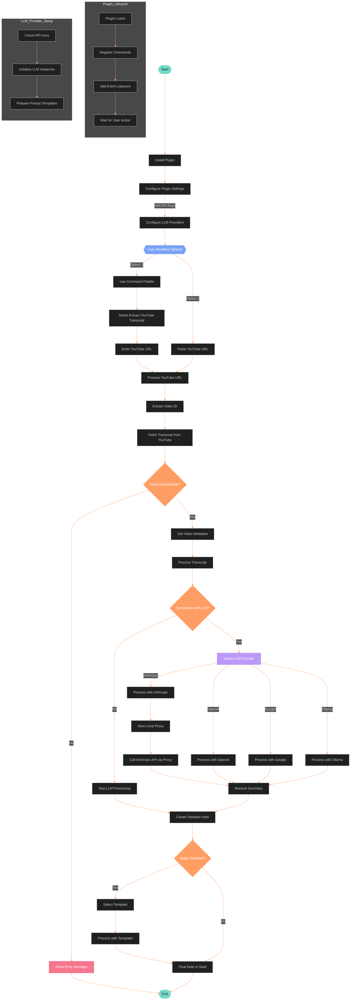

# Workflow Diagram - YouTube Transcript LLM Plugin

This diagram describes the user and system workflow for the YouTube Transcript LLM plugin for Obsidian.

```mermaid
%%{init: {
  'theme': 'dark',
  'themeVariables': {
    'fontSize': '16px',
    'primaryColor': '#ff9e64',
    'primaryTextColor': '#ffffff',
    'primaryBorderColor': '#ff9e64', 
    'lineColor': '#ff9e64',
    'secondaryColor': '#7aa2f7',
    'tertiaryColor': '#bb9af7'
  },
  'flowchart': {
    'curve': 'basis',
    'useMaxWidth': false,
    'htmlLabels': true,
    'rankSpacing': 80,
    'nodeSpacing': 60,
    'arrowSize': 1.5,
    'edgeLabelBackground': '#2d333b'
  }
}}%%
flowchart TB
    %% Main workflow steps
    Start([Start]) --> InstallPlugin[Install Plugin]
    InstallPlugin --> ConfigPlugin[Configure Plugin Settings]
    ConfigPlugin --> |Add API Keys| ConfigLLM[Configure LLM Providers]
    ConfigLLM --> UserWorkflow
    
    %% User workflow branch
    UserWorkflow{{User Workflow Options}}
    UserWorkflow --> |Option 1| Command[Use Command Palette]
    UserWorkflow --> |Option 2| URL[Paste YouTube URL]
    
    %% Command palette flow
    Command --> SelectCommand[Select Extract YouTube Transcript]
    SelectCommand --> EnterURL[Enter YouTube URL]
    EnterURL --> ProcessFlow
    
    %% URL input flow
    URL --> ProcessFlow
    
    %% Main processing flow
    ProcessFlow[Process YouTube URL]
    ProcessFlow --> ExtractID[Extract Video ID]
    ExtractID --> FetchTranscript[Fetch Transcript from YouTube]
    
    %% Transcript availability check
    FetchTranscript --> TranscriptCheck{Transcript Available?}
    TranscriptCheck --> |No| Error[Show Error Message]
    TranscriptCheck --> |Yes| GetMetadata[Get Video Metadata]
    
    %% Processing transcript
    GetMetadata --> ProcessTranscript[Process Transcript]
    ProcessTranscript --> SummarizeCheck{Summarize with LLM?}
    
    %% LLM branch
    SummarizeCheck --> |Yes| SelectLLM[Select LLM Provider]
    SelectLLM --> |OpenAI| OpenAIFlow[Process with OpenAI]
    SelectLLM --> |Google| GoogleFlow[Process with Google]
    SelectLLM --> |Anthropic| AnthropicFlow[Process with Anthropic]
    SelectLLM --> |Ollama| OllamaFlow[Process with Ollama]
    
    %% Anthropic special flow
    AnthropicFlow --> StartProxy[Start Local Proxy]
    StartProxy --> CallAnthropicAPI[Call Anthropic API via Proxy]
    CallAnthropicAPI --> ReceiveSummary[Receive Summary]
    
    %% Other LLM flows
    OpenAIFlow --> ReceiveSummary
    GoogleFlow --> ReceiveSummary
    OllamaFlow --> ReceiveSummary
    
    %% No LLM branch
    SummarizeCheck --> |No| SkipLLM[Skip LLM Processing]
    SkipLLM --> CreateNote
    
    %% Final note creation
    ReceiveSummary --> CreateNote[Create Obsidian Note]
    CreateNote --> ApplyTemplate{Apply Template?}
    
    %% Template branch
    ApplyTemplate --> |Yes| SelectTemplate[Select Template]
    SelectTemplate --> ProcessTemplate[Process with Templater]
    ProcessTemplate --> FinalNote[Final Note in Vault]
    
    %% No template branch
    ApplyTemplate --> |No| FinalNote
    
    %% Error handling
    Error --> End([End])
    FinalNote --> End
    
    %% Plugin lifecycle
    subgraph Plugin_Lifecycle
        direction TB
        PluginLoad[Plugin Loads] --> RegisterCommands[Register Commands]
        RegisterCommands --> AddEventListeners[Add Event Listeners]
        AddEventListeners --> WaitForUser[Wait for User Action]
    end
    
    %% LLM Provider setup
    subgraph LLM_Provider_Setup
        direction TB
        CheckAPIKeys[Check API Keys] --> InitializeLLMs[Initialize LLM Instances]
        InitializeLLMs --> PreparePromptTemplates[Prepare Prompt Templates]
    end
    
    %% Styling for specific node types
    style Start fill:#73daca,stroke:#73daca,color:#1a1b26,stroke-width:2px
    style End fill:#73daca,stroke:#73daca,color:#1a1b26,stroke-width:2px
    style Error fill:#f7768e,stroke:#f7768e,color:white,stroke-width:2px
    style TranscriptCheck fill:#ff9e64,stroke:#ff9e64,color:white,stroke-width:2px
    style SummarizeCheck fill:#ff9e64,stroke:#ff9e64,color:white,stroke-width:2px
    style ApplyTemplate fill:#ff9e64,stroke:#ff9e64,color:white,stroke-width:2px
    style UserWorkflow fill:#7aa2f7,stroke:#7aa2f7,color:white,stroke-width:2px
    style SelectLLM fill:#bb9af7,stroke:#bb9af7,color:white,stroke-width:2px
```

## Workflow Phases

### Setup Phase
1. **Installation**: User installs the plugin in Obsidian
2. **Configuration**: User configures the plugin settings
3. **API Keys**: User adds appropriate API keys for desired LLM providers

### User Interaction Phase
1. **Command Palette**: User can invoke the plugin via Obsidian's command palette
2. **Direct URL**: User can paste a YouTube URL directly into a note

### Processing Phase
1. **URL Processing**: 
   - Extract YouTube video ID from the URL
   - Fetch transcript from YouTube
   - Check if transcript is available
   - Get video metadata (title, author)

2. **Transcript Processing**:
   - Process raw transcript into usable text
   - User chooses whether to summarize with LLM

3. **LLM Processing** (if chosen):
   - User selects LLM provider (OpenAI, Google, Anthropic, Ollama)
   - For Anthropic: Start local proxy server
   - Send transcript to LLM with configured prompts
   - Receive summary response

4. **Note Creation**:
   - Create or update Obsidian note with transcript/summary
   - Optionally apply Templater template
   - Final note appears in Obsidian vault

### Plugin Lifecycle
- **Initialization**: Plugin loads and registers commands with Obsidian
- **Configuration**: Plugin checks for API keys and prepares LLM providers
- **Runtime**: Plugin responds to user actions and processes requests

### Error Handling
- Plugin shows error messages for missing transcripts or API issues