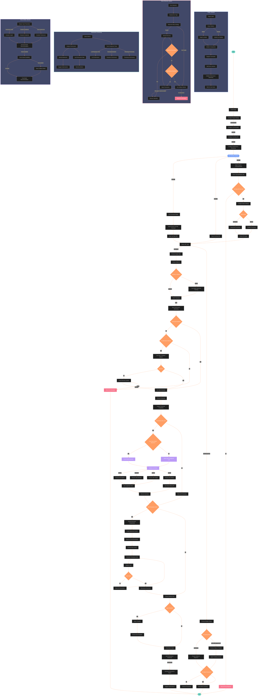

# Workflow Diagram - TubeSage

This diagram describes the user and system workflow for the TubeSage plugin for Obsidian.

```mermaid
%%{init: {
  'theme': 'dark',
  'themeVariables': {
    'fontSize': '16px',
    'primaryColor': '#ff9e64',
    'primaryTextColor': '#ffffff',
    'primaryBorderColor': '#ff9e64', 
    'lineColor': '#ff9e64',
    'secondaryColor': '#7aa2f7',
    'tertiaryColor': '#bb9af7'
  },
  'flowchart': {
    'curve': 'basis',
    'useMaxWidth': false,
    'htmlLabels': true,
    'rankSpacing': 80,
    'nodeSpacing': 60,
    'arrowSize': 1.5,
    'edgeLabelBackground': '#2d333b'
  }
}}%%
flowchart TB
    %% Main workflow steps
    Start([Start]) --> InstallPlugin[Install Plugin]
    InstallPlugin --> ConfigPlugin[Configure Plugin Settings]
    ConfigPlugin --> |Add API Keys| ConfigLLM[Configure LLM Providers]
    ConfigLLM --> |Optional| ConfigYTAPI[Configure YouTube API]
    ConfigYTAPI --> |Optional| ConfigPerf[Configure Performance Monitoring]
    ConfigPerf --> UserWorkflow
    
    %% User workflow branch
    UserWorkflow{{User Workflow Options}}
    UserWorkflow --> |Option 1| Command[Use Command Palette]
    UserWorkflow --> |Option 2| URL[Paste YouTube URL]
    UserWorkflow --> |Option 3| BatchProcess[Batch Process Channel/Playlist]
    
    %% Command palette flow
    Command --> SelectCommand[Select Extract YouTube Transcript]
    SelectCommand --> EnterURL[Enter YouTube URL]
    EnterURL --> DetectType
    
    %% URL input flow
    URL --> DetectType[Detect URL Type]
    
    %% Batch process flow
    BatchProcess --> EnterChannelURL[Enter Channel/Playlist URL]
    EnterChannelURL --> YTAPICheck{YouTube API Key Set?}
    YTAPICheck --> |No| YTAPIError[Show API Key Required]
    YTAPICheck --> |Yes| ConfigBatch[Configure Batch Settings]
    ConfigBatch --> BatchMode{Batch Mode}
    BatchMode --> |Sequential| SequentialBatch[Sequential Processing]
    BatchMode --> |Parallel| ParallelBatch[Parallel Processing]
    SequentialBatch --> QuotaCheck[Check API Quota]
    ParallelBatch --> QuotaCheck
    QuotaCheck --> DetectType
    
    %% URL type detection
    DetectType --> |Video URL| ProcessVideo[Process Single Video]
    DetectType --> |Channel/Playlist| ProcessBatch[Process Multiple Videos]
    
    %% Single video processing flow
    ProcessVideo --> ExtractID[Extract Video ID]
    ExtractID --> DetectPlatform
    
    %% Platform detection
    DetectPlatform{Desktop or Mobile?}
    DetectPlatform --> |Desktop| FetchTranscript[Fetch Transcript]
    DetectPlatform --> |Mobile| AdaptFetching[Use Mobile-Optimized Fetching]
    AdaptFetching --> FetchTranscript
    
    %% Performance monitoring
    FetchTranscript --> |Start| StartPerformanceMon[Start Performance Monitoring]
    
    %% Transcript availability check
    StartPerformanceMon --> TranscriptCheck{Transcript Available?}
    TranscriptCheck --> |No| TryAlternative{Try Alternative Method?}
    TryAlternative --> |Yes| AlternativeFetch[Use XML or Fallback Method]
    TryAlternative --> |No| Error[Show Error Message]
    AlternativeFetch --> TranscriptRecheck{Success?}
    TranscriptRecheck --> |No| SmartRecovery[Smart Recovery System]
    SmartRecovery --> |Success| GetMetadata
    SmartRecovery --> |Failed| Error
    TranscriptRecheck --> |Yes| GetMetadata
    TranscriptCheck --> |Yes| GetMetadata[Get Video Metadata]
    
    %% Processing transcript
    GetMetadata --> ProcessTranscript[Process Transcript]
    ProcessTranscript --> AnalyzeComplexity[Analyze Transcript Complexity]
    AnalyzeComplexity --> SummarizeCheck{Summarize with LLM?}
    
    %% LLM branch
    SummarizeCheck --> |Yes| ModelSelectionCheck{Use Smart Model Selection?}
    ModelSelectionCheck --> |Yes| SmartModelSelection[Smart Model Selection]
    ModelSelectionCheck --> |No| SelectLLM[Select User-Configured LLM]
    SmartModelSelection --> InitializeLLM[Initialize LLM Client]
    SelectLLM --> InitializeLLM
    
    InitializeLLM --> |OpenAI| OpenAIFlow[Process with OpenAI]
    InitializeLLM --> |Anthropic| AnthropicFlow[Process with Anthropic]
    InitializeLLM --> |Google| GoogleFlow[Process with Google]
    InitializeLLM --> |Ollama| OllamaFlow[Process with Ollama]
    
    %% LLM processing
    OpenAIFlow --> UseLangChain[Use LangChain Client]
    AnthropicFlow --> UseLangChain
    GoogleFlow --> UseLangChain
    OllamaFlow --> DirectAPI[Use Direct Ollama API]
    
    %% LLM response paths
    UseLangChain --> ReceiveSummary[Receive Summary]
    DirectAPI --> ReceiveSummary
    
    %% No LLM branch
    SummarizeCheck --> |No| SkipLLM[Skip LLM Processing]
    SkipLLM --> TimestampCheck
    
    %% Timestamp processing
    ReceiveSummary --> TimestampCheck{Add Timestamp Links?}
    TimestampCheck --> |Yes| ExtractComponents[Extract Document Components]
    ExtractComponents --> CreateChunks[Create Optimized Chunks]
    CreateChunks --> ChunkBoundaryOptimization[Optimize Chunk Boundaries]
    ChunkBoundaryOptimization --> ProcessChunks[Process Each Chunk]
    ProcessChunks --> GenerateLinks[Generate Timestamp Links]
    GenerateLinks --> ValidateLinks[Validate Links]
    ValidateLinks --> LinkValidationCheck{Links Valid?}
    LinkValidationCheck --> |No| RetryLinking[Retry Link Generation]
    RetryLinking --> GenerateLinks
    LinkValidationCheck --> |Yes| ReconstructDoc[Reconstruct Document]
    ReconstructDoc --> CreateNote
    TimestampCheck --> |No| CreateNote
    
    %% Final note creation
    CreateNote[Create Obsidian Note]
    CreateNote --> ApplyTemplate{Apply Template?}
    
    %% Template branch
    ApplyTemplate --> |Yes| SelectTemplate[Select Template]
    SelectTemplate --> ProcessTemplate[Process with Templater]
    ProcessTemplate --> FinalNote[Final Note in Vault]
    
    %% No template branch
    ApplyTemplate --> |No| FinalNote
    
    %% Performance monitoring
    FinalNote --> EndPerformanceMon[End Performance Monitoring]
    EndPerformanceMon --> |Log Metrics| PerformanceReport[Generate Performance Report]
    PerformanceReport --> OptimizationSuggestions[Suggest Optimizations]
    
    %% Error handling
    Error --> End([End])
    YTAPIError --> End
    OptimizationSuggestions --> End
    
    %% Batch processing flow
    ProcessBatch --> BatchConfig{Processing Mode}
    BatchConfig --> |Sequential| SequentialProcess[Process Videos in Sequence]
    BatchConfig --> |Parallel with Throttling| ParallelProcess[Process Videos in Parallel]
    ParallelProcess --> ThrottleControl[Apply Throttling Controls]
    ThrottleControl --> BatchComplete
    SequentialProcess --> BatchComplete{All Videos Processed?}
    BatchComplete --> |No| ContinueBatch[Continue Processing]
    BatchComplete --> |Yes| BatchSummary[Show Batch Summary]
    ContinueBatch --> BatchComplete
    BatchSummary --> End
    
    %% Plugin lifecycle
    subgraph Plugin_Lifecycle
        direction TB
        PluginLoad[Plugin Loads] --> CheckPlatform[Check Platform]
        CheckPlatform --> |Mobile| AdaptMobile[Adapt for Mobile]
        CheckPlatform --> |Desktop| DesktopInit[Initialize for Desktop]
        AdaptMobile --> InitializeComponents[Initialize Components]
        DesktopInit --> InitializeComponents
        InitializeComponents --> RegisterCommands[Register Commands]
        RegisterCommands --> AddEventListeners[Add Event Listeners]
        AddEventListeners --> InitPerformanceMon[Initialize Performance Monitoring]
        InitPerformanceMon --> WaitForUser[Wait for User Action]
    end
    
    %% Smart Recovery System
    subgraph Smart_Recovery_System
        direction TB
        ErrorDetection[Error Detection] --> ErrorClassification[Classify Error Type]
        ErrorClassification --> RetryStrategy[Determine Retry Strategy]
        RetryStrategy --> |Fixable| AttemptRecovery[Attempt Recovery]
        RetryStrategy --> |Not Fixable| FallbackMethod[Use Fallback Method]
        AttemptRecovery --> RecoveryCheck{Recovery Successful?}
        RecoveryCheck --> |No| MaxRetriesCheck{Max Retries Reached?}
        MaxRetriesCheck --> |No| AdjustParams[Adjust Parameters]
        AdjustParams --> AttemptRecovery
        MaxRetriesCheck --> |Yes| FallbackMethod
        RecoveryCheck --> |Yes| ResumeOperation[Resume Operation]
        FallbackMethod --> |Alternative Implementation| ResumeOperation
        FallbackMethod --> |No Alternative| ShowErrorMessage[Show Error Message]
    end
    
    %% Performance Monitoring System
    subgraph Performance_Monitoring
        direction TB
        CollectMetrics[Collect Metrics] --> AnalyzePerformance[Analyze Performance]
        AnalyzePerformance --> IdentifyBottlenecks[Identify Bottlenecks]
        IdentifyBottlenecks --> SuggestOptimizations[Suggest Optimizations]
        AnalyzePerformance --> LogPerformanceData[Log Performance Data]
        LogPerformanceData --> RealTimeMetrics[Real-time Metrics]
        CollectMetrics --> TrackComponentTimes[Track Component Times]
        TrackComponentTimes --> |LLM Response Time| LLMMetrics[LLM Performance]
        TrackComponentTimes --> |Transcript Extraction| ExtractionMetrics[Extraction Performance]
        TrackComponentTimes --> |Timestamp Processing| TimestampMetrics[Timestamp Performance]
    end
    
    %% Smart Model Selection System
    subgraph Smart_Model_Selection
        direction TB
        AnalyzeInput[Analyze Input Parameters] --> |Transcript Length| LengthEvaluation[Evaluate Length]
        AnalyzeInput --> |Content Complexity| ComplexityEvaluation[Evaluate Complexity]
        AnalyzeInput --> |User Preferences| PreferenceEvaluation[Consider Preferences]
        LengthEvaluation --> ModelRecommendation[Generate Model Recommendation]
        ComplexityEvaluation --> ModelRecommendation
        PreferenceEvaluation --> ModelRecommendation
        ModelRecommendation --> |Check Available| AvailabilityCheck[Check Model Availability]
        AvailabilityCheck --> |Available| FinalRecommendation[Final Model Recommendation]
        AvailabilityCheck --> |Not Available| FallbackModel[Select Fallback Model]
        FallbackModel --> FinalRecommendation
    end
    
    %% Styling for specific node types
    style Start fill:#73daca,stroke:#73daca,color:#1a1b26,stroke-width:2px
    style End fill:#73daca,stroke:#73daca,color:#1a1b26,stroke-width:2px
    style Error fill:#f7768e,stroke:#f7768e,color:white,stroke-width:2px
    style YTAPIError fill:#f7768e,stroke:#f7768e,color:white,stroke-width:2px
    style ShowErrorMessage fill:#f7768e,stroke:#f7768e,color:white,stroke-width:2px
    style TranscriptCheck fill:#ff9e64,stroke:#ff9e64,color:white,stroke-width:2px
    style SummarizeCheck fill:#ff9e64,stroke:#ff9e64,color:white,stroke-width:2px
    style ApplyTemplate fill:#ff9e64,stroke:#ff9e64,color:white,stroke-width:2px
    style DetectPlatform fill:#ff9e64,stroke:#ff9e64,color:white,stroke-width:2px
    style TryAlternative fill:#ff9e64,stroke:#ff9e64,color:white,stroke-width:2px
    style TranscriptRecheck fill:#ff9e64,stroke:#ff9e64,color:white,stroke-width:2px
    style BatchComplete fill:#ff9e64,stroke:#ff9e64,color:white,stroke-width:2px
    style YTAPICheck fill:#ff9e64,stroke:#ff9e64,color:white,stroke-width:2px
    style TimestampCheck fill:#ff9e64,stroke:#ff9e64,color:white,stroke-width:2px
    style BatchMode fill:#ff9e64,stroke:#ff9e64,color:white,stroke-width:2px
    style BatchConfig fill:#ff9e64,stroke:#ff9e64,color:white,stroke-width:2px
    style RecoveryCheck fill:#ff9e64,stroke:#ff9e64,color:white,stroke-width:2px
    style ModelSelectionCheck fill:#ff9e64,stroke:#ff9e64,color:white,stroke-width:2px
    style LinkValidationCheck fill:#ff9e64,stroke:#ff9e64,color:white,stroke-width:2px
    style MaxRetriesCheck fill:#ff9e64,stroke:#ff9e64,color:white,stroke-width:2px
    style UserWorkflow fill:#7aa2f7,stroke:#7aa2f7,color:white,stroke-width:2px
    style SelectLLM fill:#bb9af7,stroke:#bb9af7,color:white,stroke-width:2px
    style InitializeLLM fill:#bb9af7,stroke:#bb9af7,color:white,stroke-width:2px
    style SmartModelSelection fill:#bb9af7,stroke:#bb9af7,color:white,stroke-width:2px
    style Plugin_Lifecycle fill:#414868,stroke:#7aa2f7,color:white,stroke-width:2px
    style Smart_Recovery_System fill:#414868,stroke:#f7768e,color:white,stroke-width:2px
    style Performance_Monitoring fill:#414868,stroke:#73daca,color:white,stroke-width:2px
    style Smart_Model_Selection fill:#414868,stroke:#bb9af7,color:white,stroke-width:2px
```

## Workflow Phases

### Setup Phase
1. **Installation**: User installs the plugin in Obsidian
2. **Configuration**: User configures the plugin settings
3. **API Keys**: User adds appropriate API keys for desired LLM providers
4. **YouTube API Setup**: Optional configuration for channel/playlist processing
5. **Performance Monitoring**: Optional configuration for performance tracking and optimization

### User Interaction Phase
1. **Command Palette**: User can invoke the plugin via Obsidian's command palette
2. **Direct URL**: User can paste a YouTube URL directly into a note
3. **Batch Processing**: User can process YouTube channels or playlists with enhanced quota management

### Processing Phase
1. **URL Processing**: 
   - Detect URL type (video, channel, playlist)
   - Extract YouTube video ID(s)
   - Platform detection (mobile vs desktop)
   - Fetch transcript with platform-specific optimizations

2. **Transcript Processing**:
   - Multiple extraction methods with enhanced fallbacks for better reliability
   - XML and JSON format support with improved parsing
   - Adaptive processing for mobile compatibility
   - Get video metadata (title, author)
   - Smart recovery system for handling extraction failures

3. **LLM Processing**:
   - Smart model selection based on transcript complexity and length
   - Factory-based LLM client initialization
   - Provider selection (OpenAI, Anthropic, Google, Ollama)
   - LangChain integration with unified fetch implementation
   - Direct API usage for Ollama
   - Prompt template processing with mode selection (Fast/Extensive)
   - Reference material handling for improved context

4. **Timestamp Processing**:
   - Extract document components (frontmatter, content)
   - Create optimized chunks with improved boundary detection
   - Process each chunk to add timestamp links
   - Enhanced validation with retry mechanism for timestamp links
   - Reconstruct final document with enhanced navigation

5. **Note Creation**:
   - Create or update Obsidian note with transcript/summary
   - Optionally apply Templater template
   - Final note appears in Obsidian vault

### Batch Processing
- **Channel/Playlist Handling**: Extract and process multiple videos
- **Processing Options**: Sequential or parallel with enhanced throttling
- **Quota Management**: Track and manage YouTube API quotas to prevent rate limits
- **Progress Tracking**: Real-time reporting of batch processing progress
- **Batch Summary**: Final report of processing results with detailed metrics

### Performance Monitoring
- **Metric Collection**: Track processing times for key operations with higher granularity
- **Bottleneck Analysis**: Identify slow components in the processing pipeline
- **Real-time Metrics**: Display processing performance in real-time
- **Component-specific Tracking**: Separate metrics for LLM, extraction, and timestamp processing
- **Optimization Suggestions**: Provide specific recommendations based on metrics
- **Reporting**: Generate detailed performance reports for user feedback

### Smart Recovery System
- **Error Detection**: Enhanced detection of various error types
- **Error Classification**: Categorize errors by type, severity, and recoverability
- **Retry Strategy**: Determine appropriate recovery actions with parameters optimization
- **Maximum Retries**: Smart handling of retry limits to prevent endless loops
- **Parameter Adjustment**: Dynamically adjust parameters between retry attempts
- **Fallback Methods**: Implement alternative approaches when primary methods fail
- **User Feedback**: Provide clear error messages and context-aware suggestions

### Smart Model Selection
- **Input Analysis**: Analyze transcript length, complexity, and content type
- **Length Evaluation**: Match transcript length to appropriate model capacity
- **Complexity Evaluation**: Assess content complexity to select model capabilities
- **Preference Consideration**: Balance user preferences with optimal performance
- **Availability Check**: Verify selected model is available and accessible
- **Fallback Selection**: Choose appropriate alternatives when preferred models are unavailable

### Plugin Lifecycle
- **Platform Detection**: Enhanced detection of desktop vs mobile environments
- **Mobile Adaptation**: Specialized optimizations for mobile performance
- **Component Initialization**: Platform-aware component initialization
- **Command Registration**: Extended command options with improved descriptions
- **Event Handling**: Comprehensive event listener management
- **Performance Monitoring**: Integrated performance tracking from startup